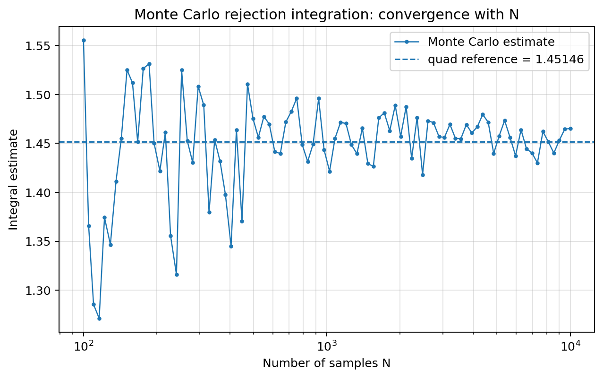
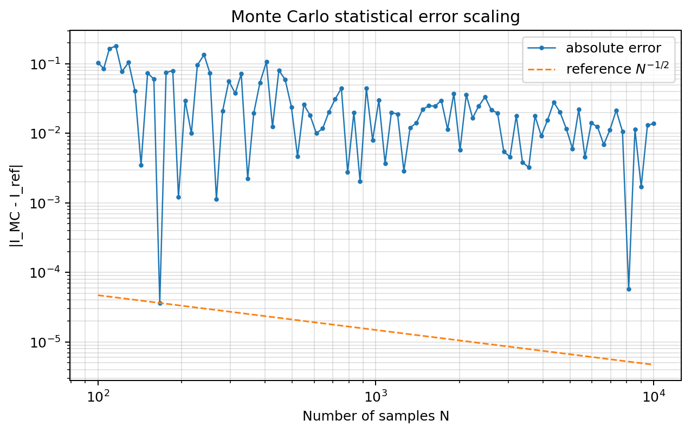
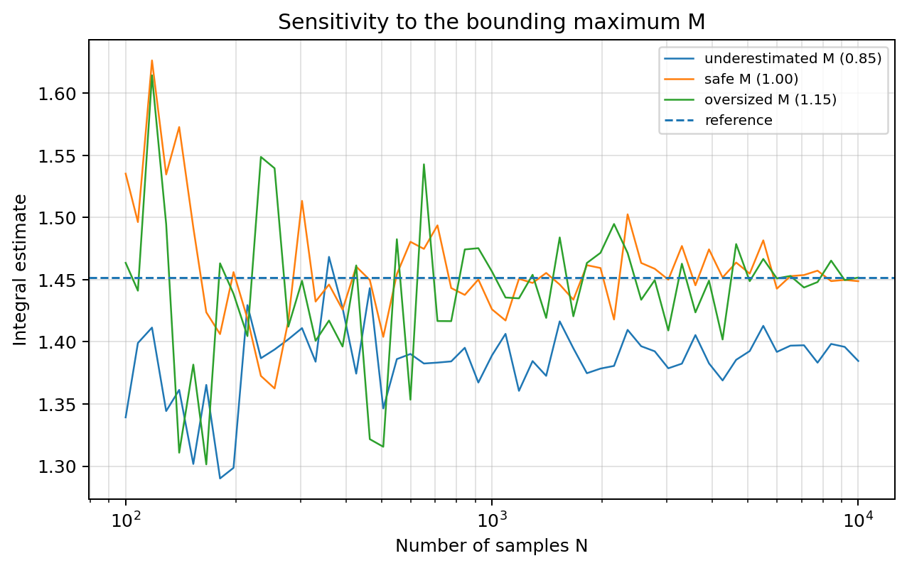
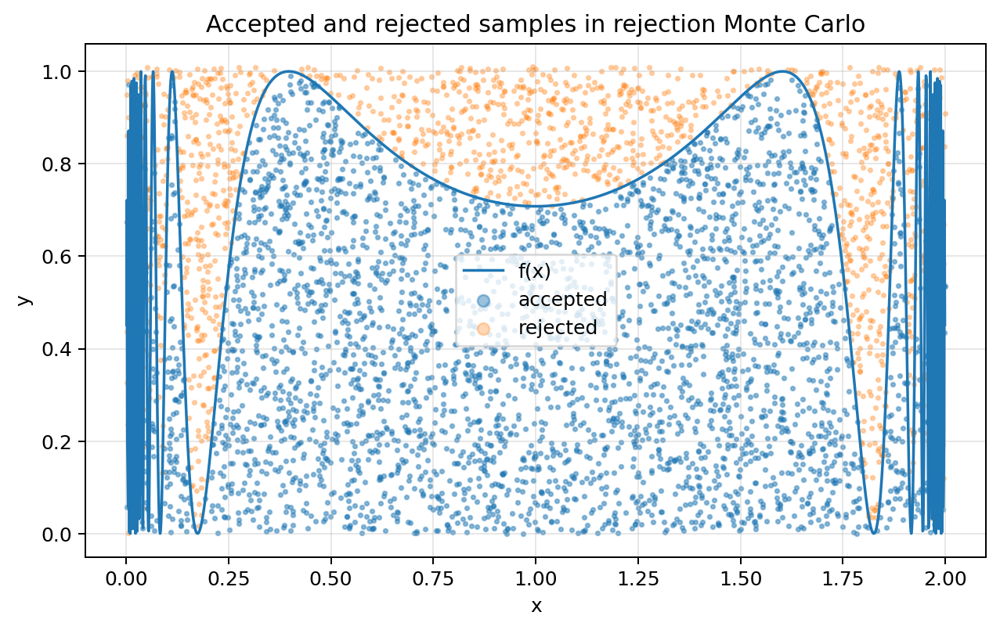
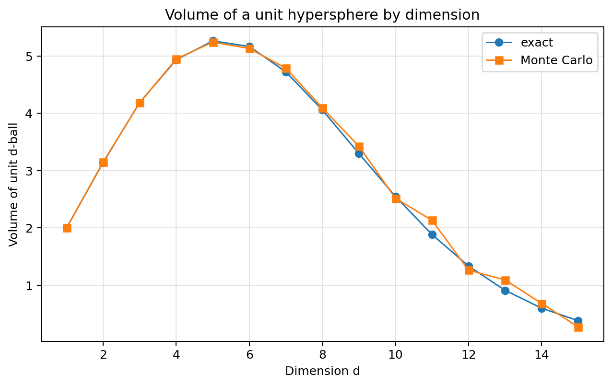
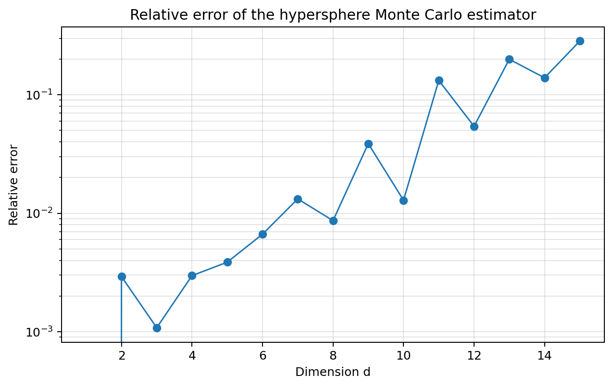
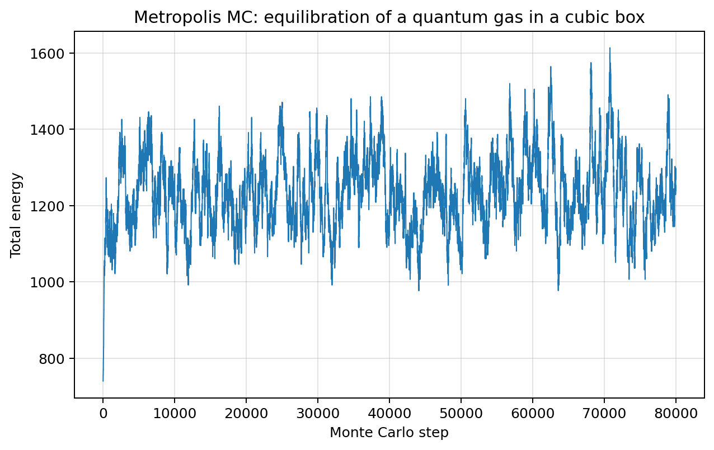
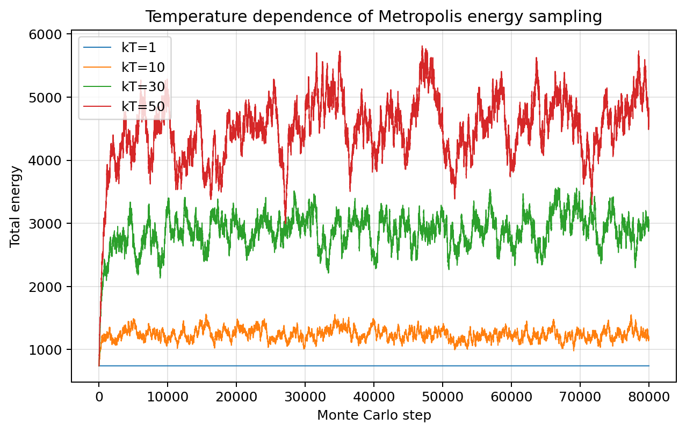
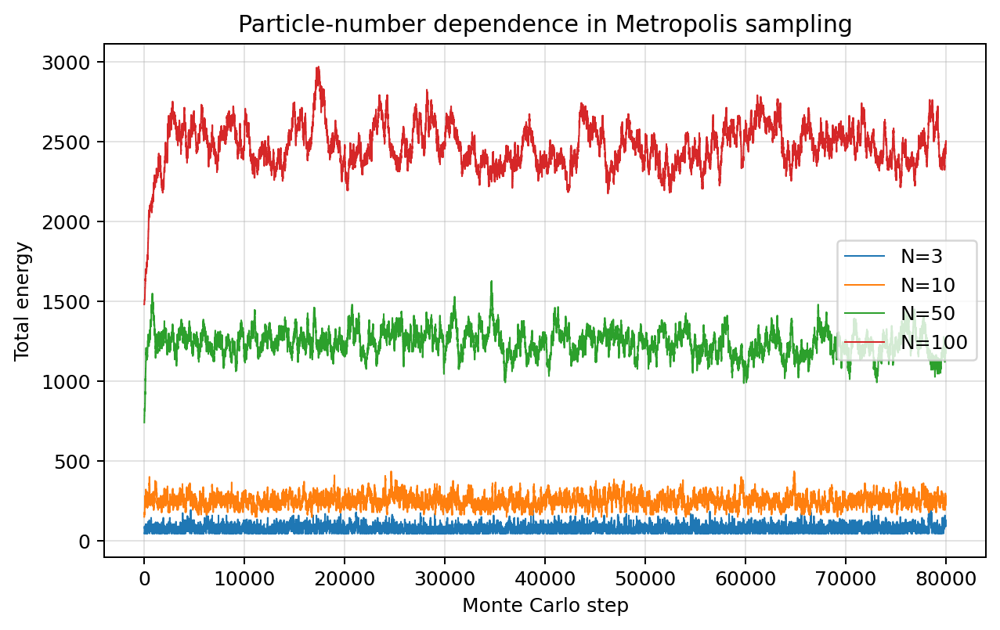
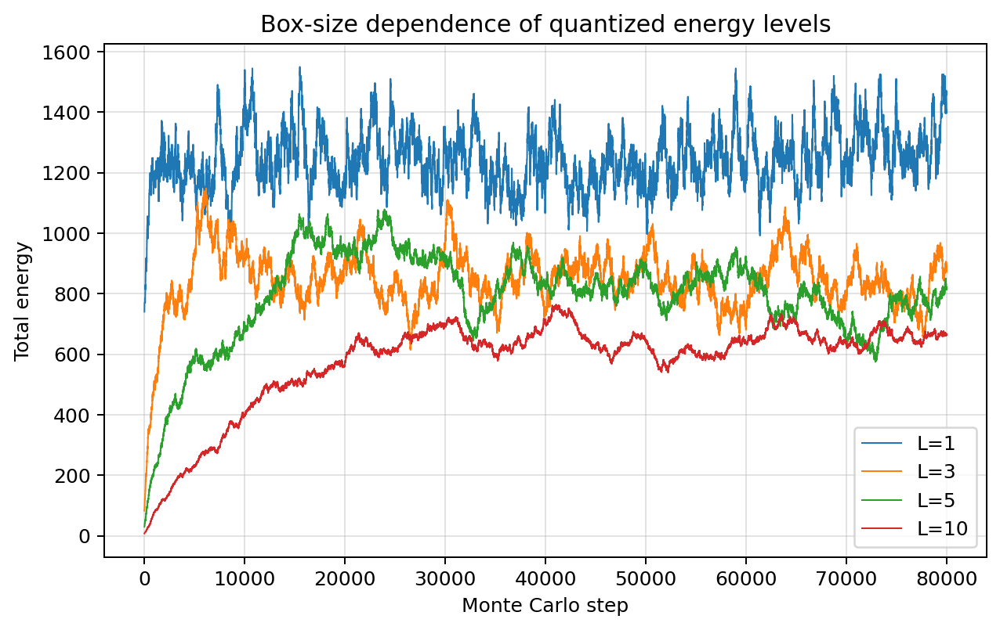

# Results analysis

This document provides a detailed interpretation of the figures generated by the project. The goal is not only to describe what each plot shows, but also to explain why the observed behaviour is physically and numerically expected.

The repository is organised around three computational-physics problems:

1. **Rejection Monte Carlo integration**, used to estimate one-dimensional integrals from random sampling.
2. **Monte Carlo estimation of hypersphere volumes**, used to study the behaviour of stochastic integration in increasing dimension.
3. **Metropolis Monte Carlo sampling**, applied to particles in a cubic quantum box.

All results can be regenerated by running:

```bash
python run_all.py
```

This file assumes that it is located inside the `docs/` folder and that all figures are stored in the `figures/` folder. For that reason, figures are embedded using paths of the form:

```md
../figures/figure_name.png
```

---

## 1. Rejection Monte Carlo integration

The first part of the project studies the rejection Monte Carlo method as a numerical strategy for estimating definite integrals. The example function is

$$
f(x)=\sin^2\left(\frac{1}{x(2-x)}\right),
\qquad x\in[0,2].
$$

This function is a useful test case because it is bounded but highly oscillatory close to the endpoints of the interval. A deterministic quadrature method would need to resolve the structure of the function carefully, especially near the boundaries. Monte Carlo integration approaches the problem differently: instead of building a deterministic grid, it estimates the area under the curve from random samples.

For a non-negative function \(f(x)\) defined on \([a,b]\), rejection Monte Carlo starts by choosing a value \(M\) such that

$$
f(x)\leq M
\qquad \text{for all }x\in[a,b].
$$

Then, random points \((x_i,y_i)\) are drawn uniformly in the rectangle

$$
[a,b]\times[0,M].
$$

A point is accepted if it lies below the function:

$$
y_i\leq f(x_i).
$$

If \(k\) out of \(N\) generated points are accepted, then the integral is estimated as

$$
\hat I_N=(b-a)M\frac{k}{N}.
$$

The method is therefore based on a geometric probability: the fraction of points below the curve estimates the fraction of the rectangle occupied by the area under the curve.

---

## 1.1 Integral convergence with sample number



The first figure shows how the Monte Carlo estimate of the integral changes as the number of sampled points \(N\) increases. The dashed horizontal line represents the reference value computed using `scipy.integrate.quad`, while the Monte Carlo curve shows the stochastic estimate obtained from the accept/reject procedure.

For small values of \(N\), the estimate fluctuates strongly. This is expected because every accepted or rejected point has a large statistical weight. With only a small number of samples, a small excess or deficit of accepted points can noticeably change the estimated value of the integral.

As \(N\) increases, the estimate becomes more stable and fluctuates around the reference value. This behaviour follows from the law of large numbers. The empirical acceptance ratio

$$
\frac{k}{N}
$$

converges statistically to the true probability \(p\) that a uniformly sampled point in the bounding rectangle lies below the curve. Therefore,

$$
\frac{k}{N}\longrightarrow p
$$

and the Monte Carlo estimator converges to

$$
\hat I_N=(b-a)M\frac{k}{N}\longrightarrow (b-a)Mp=I.
$$

The important point is that the convergence is statistical rather than deterministic. The curve does not need to approach the reference value monotonically. A larger sample size reduces the expected size of the fluctuations, but a single finite run can still move slightly above or below the reference value.

In this project, the reference value for the integral is approximately

$$
I\approx 1.451496.
$$

This number is not hard-coded in the project. It is computed numerically and used only as a benchmark to validate the Monte Carlo calculation.

This plot demonstrates three important features of Monte Carlo integration:

- the estimator is valid when the sampling domain fully contains the function;
- the estimate becomes more stable as the number of samples increases;
- stochastic convergence should be interpreted through statistical fluctuations, not through perfectly smooth convergence.

---

## 1.2 Error scaling and the \(N^{-1/2}\) law



The second figure shows the absolute error

$$
|\hat I_N-I|
$$

as a function of the number of samples \(N\). The plot also includes a reference trend proportional to

$$
N^{-1/2}.
$$

This scaling is one of the central results of simple Monte Carlo methods. In rejection Monte Carlo, each sampled point defines a Bernoulli random variable:

$$
X_i=
\begin{cases}
1, & y_i\leq f(x_i),\\
0, & y_i>f(x_i).
\end{cases}
$$

The number of accepted points is

$$
k=\sum_{i=1}^{N}X_i.
$$

Because the points are sampled independently, \(k\) follows a binomial distribution:

$$
k\sim \mathrm{Binomial}(N,p),
$$

where \(p\) is the true probability of acceptance. The variance of the accepted fraction is

$$
\mathrm{Var}\left(\frac{k}{N}\right) =
\frac{p(1-p)}{N}.
$$

Since the integral estimate is obtained by multiplying this fraction by the area of the bounding rectangle,

$$
A=(b-a)M,
$$

the standard deviation of the estimator scales as

$$
\sigma_{\hat I}\propto\frac{1}{\sqrt{N}}.
$$

This explains the reference \(N^{-1/2}\) line.

The error curve is not perfectly smooth. This is also expected. The plotted error corresponds to one stochastic realisation, not to an average over infinitely many simulations. If the random seed were changed, the detailed shape of the curve would also change, although the global statistical behaviour would remain compatible with the \(N^{-1/2}\) trend.

This distinction is important in scientific computing. Deterministic methods such as Simpson integration often show a smoother reduction of the error as the grid is refined. Monte Carlo methods instead converge in probability. Therefore, the correct diagnostic is not whether the error decreases at every single point, but whether the overall trend is statistically consistent with the expected scaling.

The figure shows that the algorithm behaves as expected: the error becomes smaller as \(N\) increases, but random fluctuations remain visible.

---

## 1.3 Sensitivity to the bounding maximum \(M\)



The third figure compares the Monte Carlo estimate obtained with three different choices of the bounding maximum \(M\):

1. an underestimated value of \(M\);
2. a valid value close to the true maximum;
3. an oversized value of \(M\).

This plot is important because it separates two different types of numerical error: **statistical error** and **systematic bias**.

If \(M\) is chosen below the true maximum of the function, part of the function lies outside the sampling rectangle. In that case, the algorithm does not sample the full area under the curve. The estimator then converges to a truncated integral:

$$
\hat I_N\longrightarrow I_{\mathrm{truncated}}<I.
$$

Increasing the number of samples cannot fix this problem. More samples reduce random fluctuations, but they do not recover the missing region because that region was excluded from the sampling domain from the beginning. This is a systematic error.

If \(M\) is chosen correctly, so that the whole function is contained inside the sampling rectangle, the estimator is unbiased. In that case, the method converges statistically to the correct value.

If \(M\) is much larger than necessary, the estimator remains unbiased but becomes inefficient. The rectangle contains a large region above the function, so many sampled points are rejected. The acceptance probability is

$$
p=\frac{I}{(b-a)M}.
$$

When \(M\) increases while \(I\) remains fixed, the acceptance probability decreases. A smaller acceptance probability means fewer useful samples and therefore larger variance for the same computational effort.

The figure illustrates the following conclusions:

- if \(M\) is too small, the method is biased;
- if \(M\) is valid and close to the true maximum, the method is both correct and efficient;
- if \(M\) is too large, the method is correct but inefficient.

This is a key lesson in numerical simulation. A simulation can appear stable and converged while still converging to the wrong value if the sampling domain is incorrectly defined.

---

## 1.4 Accept/reject geometry



The fourth figure shows the geometric interpretation of rejection Monte Carlo. Random points are generated uniformly in the rectangle containing the function. Points below the curve are accepted, while points above the curve are rejected.

The accepted points fill the area under the curve statistically. Therefore, the ratio

$$
\frac{N_{\mathrm{accepted}}}{N_{\mathrm{total}}}
$$

approximates the ratio between the integral and the area of the bounding rectangle.

This plot is useful because it makes the algorithm visually intuitive. The method is not evaluating the function on a fixed grid. Instead, it estimates an area through the frequency of random events.

The figure also shows why rejection sampling can be inefficient. Every rejected point still costs computation, but it does not directly contribute to the accepted count. If the bounding rectangle is much larger than the function, or if the region of interest is very small, most samples are wasted.

This limitation becomes especially important in high-dimensional problems, where the relevant region may occupy a very small fraction of the total sampling domain. This motivates more advanced stochastic methods such as:

- importance sampling;
- Markov Chain Monte Carlo;
- Metropolis sampling;
- simulated annealing.

The accept/reject plot therefore acts as a conceptual bridge between simple Monte Carlo integration and more physically guided sampling algorithms.

---

## 2. Hypersphere volume estimation

The second part of the project applies Monte Carlo sampling to a higher-dimensional problem: estimating the volume of a unit hypersphere.

The exact volume of a hypersphere of radius \(r\) in \(D\) dimensions is

$$
V_D(r)=\frac{\pi^{D/2}}{\Gamma(D/2+1)}r^D.
$$

For a unit hypersphere, \(r=1\), so

$$
V_D(1)=\frac{\pi^{D/2}}{\Gamma(D/2+1)}.
$$

The Monte Carlo estimator is constructed by sampling points uniformly inside the hypercube

$$
[-r,r]^D.
$$

The volume of this hypercube is

$$
V_{\mathrm{cube}}=(2r)^D.
$$

A sampled point belongs to the hypersphere if

$$
x_1^2+x_2^2+\cdots+x_D^2\leq r^2.
$$

If \(N_{\mathrm{inside}}\) out of \(N\) sampled points fall inside the hypersphere, the estimated volume is

$$
\hat V_D=(2r)^D\frac{N_{\mathrm{inside}}}{N}.
$$

This is the same geometric idea as rejection Monte Carlo integration, but applied to a multidimensional volume.

---

## 2.1 Hypersphere volume as a function of dimension



This figure compares the Monte Carlo estimate of the unit hypersphere volume with the exact analytical value as the dimension increases.

The behaviour of the unit hypersphere volume is initially counterintuitive. The volume does not increase forever with dimension. Instead, it increases for low dimensions, reaches a maximum, and then decreases. This follows from the Gamma-function formula

$$
V_D(1)=\frac{\pi^{D/2}}{\Gamma(D/2+1)}.
$$

The Monte Carlo estimates follow the exact curve well in low and moderate dimensions. In these dimensions, the hypersphere still occupies a sufficiently large fraction of the containing hypercube, so uniform sampling captures the volume reasonably efficiently.

At higher dimensions, the agreement becomes worse for a fixed number of samples. The reason is geometric. The hypercube volume grows as

$$
2^D,
$$

whereas the unit hypersphere occupies a smaller and smaller fraction of that hypercube. The acceptance probability is

$$
p_D=\frac{V_D(1)}{2^D}.
$$

As \(D\) increases, \(p_D\) becomes small. This means that most points sampled uniformly in the hypercube fall outside the hypersphere. The number of accepted points becomes small relative to the total number of samples, and the statistical uncertainty increases.

This figure demonstrates a subtle but important point. Monte Carlo methods are often useful in high-dimensional problems because they avoid the direct exponential grid cost of deterministic quadrature. However, naive uniform sampling can still become inefficient if the relevant region occupies a tiny fraction of the sampling space.

The estimator is mathematically correct, but the sampling strategy becomes inefficient at high dimension.

---

## 2.2 Relative error and the curse of dimensionality



This figure shows the relative error of the Monte Carlo hypersphere-volume estimate:

$$
\epsilon_{\mathrm{rel}} =
\left|
\frac{\hat V_D-V_D}{V_D}
\right|.
$$

For low and moderate dimensions, the relative error remains small. This agrees with the previous figure: the estimator is able to reproduce the exact hypersphere volume when the accepted fraction is not too small.

At higher dimensions, the relative error increases. This is not caused by an error in the analytical formula or by a conceptual mistake in the implementation. It is a consequence of sampling efficiency.

The accepted count follows binomial statistics:

$$
N_{\mathrm{inside}}\sim \mathrm{Binomial}(N,p_D).
$$

The standard deviation of the accepted fraction is

$$
\sigma_p=
\sqrt{\frac{p_D(1-p_D)}{N}}.
$$

However, the relative error depends on this uncertainty compared to the true probability \(p_D\). Roughly,

$$
\frac{\sigma_p}{p_D}
\sim
\sqrt{\frac{1-p_D}{Np_D}}.
$$

When \(p_D\) becomes small, the product \(Np_D\) controls the effective number of accepted samples. If only a small number of points fall inside the hypersphere, the estimate becomes noisy relative to the true value.

This is a clear example of the **curse of dimensionality**. The problem is not that Monte Carlo has stopped working, but that naive uniform sampling is no longer efficient enough. A more advanced approach could use:

- importance sampling;
- stratified sampling;
- quasi-Monte Carlo sequences;
- adaptive sampling;
- problem-specific coordinate transformations.

This section therefore shows both the strength and limitation of simple Monte Carlo sampling. It extends naturally to high dimensions, but efficiency depends strongly on how well the sampling distribution matches the important region of the problem.

---

## 3. Metropolis Monte Carlo for particles in a cubic quantum box

The third part of the project implements a Metropolis Monte Carlo simulation for particles in a cubic quantum box.

Each particle is described by three quantum numbers

$$
(n_x,n_y,n_z),
$$

with

$$
n_x,n_y,n_z\geq 1.
$$

The single-particle energy is

$$
E(n_x,n_y,n_z) =
\frac{h^2\pi^2}{2mL^2}
\left(n_x^2+n_y^2+n_z^2\right).
$$

The simulation starts with all particles in the ground state:

$$
(n_x,n_y,n_z)=(1,1,1).
$$

At each Monte Carlo step:

1. one particle is selected randomly;
2. one of its three quantum numbers is selected randomly;
3. a trial move \(n_i\to n_i\pm1\) is proposed;
4. moves that would produce \(n_i<1\) are rejected;
5. the energy difference \(\Delta E\) is computed;
6. the move is accepted or rejected using the Metropolis criterion.

The Metropolis acceptance rule is

$$
P_{\mathrm{accept}} =
\begin{cases}
1, & \Delta E\leq 0,\\
\exp(-\Delta E/kT), & \Delta E>0.
\end{cases}
$$

This rule means that energetically favourable moves are always accepted, while energetically unfavourable moves can still be accepted with a probability controlled by the thermal energy scale \(kT\).

The algorithm therefore does not simply minimize energy. Instead, it samples a distribution of states compatible with thermal equilibrium.

---

## 3.1 Base Metropolis energy evolution



This figure shows the total energy of the system as a function of the Monte Carlo step for fixed values of \(N\), \(L\) and \(kT\).

The initial state is artificially ordered: all particles start in the lowest possible quantum state. Therefore, the initial energy is

$$
E_{\mathrm{initial}} =
N E_{1,1,1}.
$$

Once the Metropolis updates begin, the system starts exploring excited states. The energy rapidly leaves the initial value and begins to fluctuate around a statistical equilibrium.

These fluctuations are not numerical error. They are a physical consequence of sampling a finite system at non-zero effective temperature. In a thermal ensemble, the system does not remain at a single fixed energy. Instead, it samples configurations with different energies according to their Boltzmann weight.

The curve contains two main regimes:

1. **Initial relaxation:** the system moves away from the artificial ground-state initial condition.
2. **Equilibrium sampling:** the energy fluctuates around a statistically stable average value.

The equilibrium energy should therefore be interpreted statistically. A single final value is not the main result; the relevant information is contained in the average behaviour and fluctuations after equilibration.

This figure demonstrates that the Markov chain is performing physical sampling rather than deterministic minimization.

---

## 3.2 Dependence on effective temperature \(kT\)



This figure compares the evolution of the total energy for different values of \(kT\).

The observed behaviour follows directly from the acceptance probability for energetically uphill moves:

$$
P_{\mathrm{accept}}=\exp(-\Delta E/kT).
$$

For low \(kT\), upward moves are strongly suppressed. If \(\Delta E>0\), then

$$
\exp(-\Delta E/kT)\ll 1.
$$

The system therefore remains close to low-energy states. The energy stays low and the fluctuations are small.

For intermediate \(kT\), energy-increasing moves become more likely. The system can access more excited states, so the average energy increases and the fluctuations become more visible.

For high \(kT\), many uphill moves have significant acceptance probability. When \(kT\) is large compared with \(\Delta E\),

$$
\exp(-\Delta E/kT)\approx 1.
$$

The system then explores a much broader region of configuration space. This produces higher average energy and larger fluctuations.

This plot shows that temperature controls the exploration of the state space. In physical language, increasing \(kT\) allows the system to occupy higher-energy states. In algorithmic language, increasing \(kT\) makes the Markov chain more willing to accept uphill moves.

This is closely related to the idea of simulated annealing. At high temperature, the system explores widely; at low temperature, it becomes increasingly restricted to low-energy configurations.

---

## 3.3 Dependence on number of particles



This figure shows the total energy evolution for different numbers of particles.

The plotted quantity is the **total energy**, which is an extensive observable. Therefore, increasing the number of particles naturally increases the energy scale. If the particles are statistically similar, the total energy is expected to scale approximately as

$$
E_{\mathrm{total}}\propto N.
$$

This explains why the curves for larger \(N\) appear at higher energies. The result does not necessarily mean that each individual particle has a higher energy. It mainly reflects that the total energy sums over more particles.

For comparing systems with different particle numbers, a more direct observable would be the energy per particle:

$$
e=\frac{E_{\mathrm{total}}}{N}.
$$

This would remove the extensive scaling and allow a comparison of the average energetic contribution of each particle.

The fluctuations also depend on \(N\). The absolute magnitude of the fluctuations can grow with system size because more particles contribute to the total energy. However, the relative fluctuations are expected to become smoother in larger systems. This is a standard statistical-physics effect: relative fluctuations often decrease with system size, typically following a trend related to

$$
\frac{1}{\sqrt{N}}.
$$

This figure therefore illustrates the distinction between extensive and intensive quantities:

- total energy is extensive;
- energy per particle is intensive;
- larger systems can have larger absolute fluctuations but smaller relative fluctuations.

This distinction is important when analysing numerical simulations. Without it, one might incorrectly interpret a simple increase in total energy as a change in the underlying physics rather than as a consequence of increasing system size.

---

## 3.4 Dependence on box length \(L\)



This figure shows the energy evolution for different values of the cubic box length \(L\).

The energy spectrum of a particle in a cubic box is

$$
E(n_x,n_y,n_z) =
\frac{h^2\pi^2}{2mL^2}
\left(n_x^2+n_y^2+n_z^2\right).
$$

The essential dependence is

$$
E\propto\frac{1}{L^2}.
$$

Therefore, increasing the box length lowers the energy scale and reduces the spacing between neighbouring quantum states.

This explains the trend observed in the plot: larger boxes lead to lower total energies. A particle confined in a smaller box has a higher kinetic energy because the spatial confinement is stronger. A larger box relaxes this confinement and compresses the spectrum.

The value of \(L\) also affects the Metropolis dynamics. The acceptance probability depends on the ratio

$$
\frac{\Delta E}{kT}.
$$

When \(L\) is larger, energy differences between neighbouring quantum states become smaller. Therefore, the same proposed change in a quantum number can have a different acceptance probability depending on the box size.

This plot connects the stochastic algorithm with the underlying quantum-mechanical model. The Monte Carlo method determines how states are sampled, but the energy landscape itself is fixed by the analytical expression for a particle in a box.

The result is physically consistent:

- smaller boxes produce larger confinement energies;
- larger boxes produce lower energy levels;
- the spacing between states scales as \(1/L^2\);
- the Metropolis acceptance behaviour depends on \(\Delta E/kT\).

---

## 4. Cross-comparison of the three parts

Although the three parts of the project study different numerical problems, they are connected by a common idea: stochastic sampling can estimate physical or mathematical quantities when direct deterministic evaluation is inconvenient, inefficient or less natural.

---

## 4.1 Rejection Monte Carlo versus Metropolis Monte Carlo

Rejection Monte Carlo samples points independently from a uniform distribution over a predefined domain. It is simple, visual and easy to validate. However, it can waste many samples if the accepted region is small.

Metropolis Monte Carlo is different. The samples form a Markov chain, where each new state depends on the previous state. Instead of sampling uniformly everywhere, the algorithm accepts or rejects proposed moves so that the chain preferentially explores physically relevant states.

| Method | Sampling strategy | Main advantage | Main limitation |
|---|---|---|---|
| Rejection Monte Carlo | Independent uniform samples | Simple and geometrically intuitive | Can waste many samples |
| Hypersphere Monte Carlo | Uniform samples in a hypercube | Extends directly to higher dimensions | Inefficient when accepted volume is small |
| Metropolis Monte Carlo | Markov chain with physical acceptance rule | Samples thermally relevant states | Requires equilibration and produces correlated samples |

This progression is important. The project begins with basic geometric Monte Carlo, then shows the inefficiency of naive sampling in high dimensions, and finally introduces a physically motivated sampling algorithm.

---

## 4.2 Statistical noise versus systematic error

A major lesson from the results is the difference between statistical noise and systematic error.

Statistical noise appears because the number of samples is finite. It decreases as \(N\) increases and usually follows a \(1/\sqrt{N}\) scaling.

Systematic error appears when the estimator is incorrectly defined. For example, if the bounding maximum \(M\) is smaller than the true maximum of the function, the rejection Monte Carlo estimator becomes biased. It then converges to the wrong value even as \(N\to\infty\).

This distinction is central in computational physics. A simulation can look stable and well converged while still being wrong if the model, sampling domain, boundary conditions or estimator are incorrectly specified.

---

## 4.3 Why validation matters

Each part of the project includes a form of validation:

- the one-dimensional integral is compared with `scipy.integrate.quad`;
- the hypersphere volume is compared with the analytical Gamma-function formula;
- the Metropolis results are interpreted through the expected dependence on \(kT\), \(N\) and \(L\).

This matters because plotting simulation output is not enough. Scientific code should always be checked against theory, known limits or reference calculations.

The workflow followed in this project is:

1. define the physical or mathematical model;
2. implement the numerical algorithm;
3. generate reproducible plots;
4. compare with analytical or reference behaviour;
5. interpret deviations physically and numerically.

This is the standard logic of scientific computing.

---

## 5. Limitations and possible improvements

The project is intentionally educational and focused on clarity. Several improvements could be added in a more advanced version.

---

## 5.1 Random seeds and reproducibility

The figures are generated from stochastic sampling, so exact curves can change between runs. A future version could expose the random seed as a parameter.

For example:

```python
np.random.seed(1234)
```

or using NumPy's modern random generator:

```python
rng = np.random.default_rng(1234)
```

This would make every stochastic realisation exactly reproducible.

---

## 5.2 Repeated trials and error bars

The current figures show representative runs. A more complete statistical analysis would repeat each simulation many times and compute:

- mean estimator;
- standard deviation;
- confidence intervals;
- acceptance rate;
- statistical error bars.

For the integral, one could compute the average estimate

$$
\langle \hat I_N\rangle
$$

and the standard deviation

$$
\sigma_{\hat I_N}
$$

over many independent runs.

This would make the convergence envelope clearer than a single stochastic trajectory.

---

## 5.3 Improved high-dimensional sampling

The hypersphere problem shows that naive uniform sampling becomes inefficient in high dimensions. Possible improvements include:

- importance sampling;
- stratified sampling;
- quasi-Monte Carlo sequences;
- radial sampling;
- adaptive Monte Carlo methods.

These techniques would reduce variance and improve efficiency when the important region occupies only a small part of the sampling domain.

---

## 5.4 Metropolis equilibration and production sampling

In the Metropolis simulation, the first part of the trajectory corresponds to relaxation from the initial condition. A more advanced analysis would separate:

- burn-in phase;
- equilibrium phase;
- production sampling phase.

For example:

```python
E_equilibrium = E_history[burn_in:]
mean_energy = np.mean(E_equilibrium)
```

This would produce a more reliable estimate of equilibrium observables.

---

## 5.5 Energy per particle

For the particle-number study, total energy is useful because it shows extensivity. However, energy per particle would be better for comparing different system sizes:

$$
e=\frac{E_{\mathrm{total}}}{N}.
$$

A future version could include both total energy and energy per particle.

---

## 6. What the project demonstrates

This repository demonstrates several skills relevant to computational physics, scientific software and molecular simulation:

- implementation of stochastic algorithms from mathematical definitions;
- Monte Carlo integration using accept/reject sampling;
- validation against numerical reference integrals;
- analysis of the \(N^{-1/2}\) convergence law;
- identification of systematic bias caused by an invalid sampling domain;
- estimation of high-dimensional volumes;
- interpretation of dimensional effects and sampling efficiency;
- implementation of the Metropolis Monte Carlo rule;
- connection between quantum energy levels and statistical sampling;
- analysis of temperature, system-size and box-size dependence;
- generation of reproducible scientific plots;
- documentation of equations, algorithms and numerical results.

The project is not intended to be production-level molecular-simulation software. Instead, it is a polished computational-physics portfolio project showing how physical reasoning, numerical algorithms, Python implementation and result interpretation can be combined in a clear workflow.

The core transferable skills are:

1. translating theory into algorithms;
2. implementing numerical methods carefully;
3. validating code against known results;
4. understanding statistical and systematic errors;
5. explaining plots through physical reasoning;
6. documenting scientific code clearly.

These habits are directly relevant to scientific-software environments, especially those involving stochastic methods, simulation workflows, numerical validation and research-oriented Python programming.
